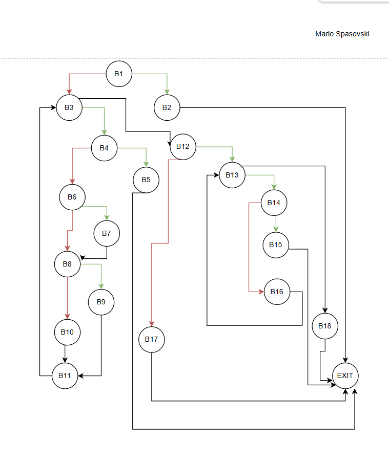
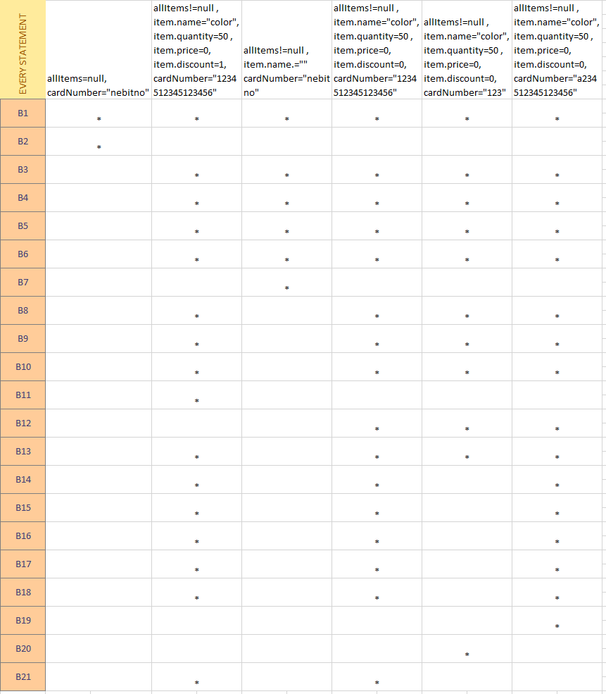
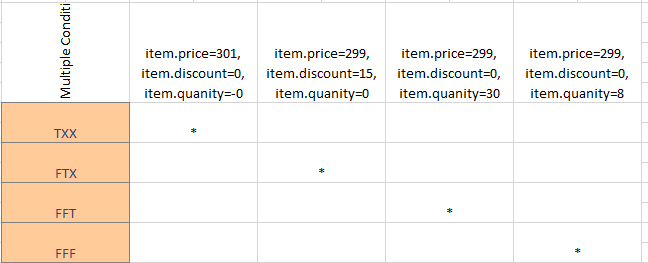
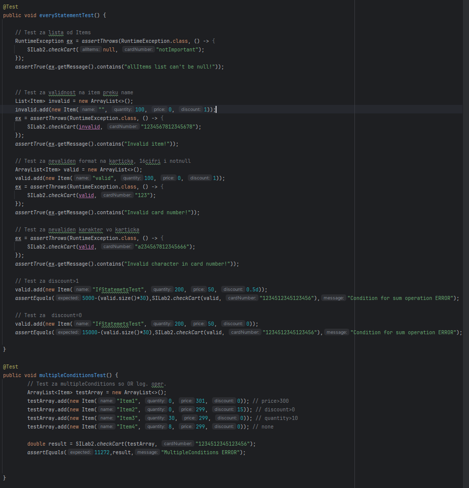

# SI_2025_lab2_233009
Mario Spasovski 233009

2.
 

3. Цикломатската комплексност на дадениот код е 9 , односно бројот на региони.
   Друга формула за комплексност е Број на ребра - број на јазли + 2 = 9

4. За да се постигне Every State критериумот се потребни минимум 6 тестови.
Секоја линија е обележана со B[1-21] во табелата, поентата е секоја линија
да биде посетена барем еднаш, односно да се опфатат сите случаи.
Тест1 - тест кој фрла исклучок за нулев објект  
Тест2 - тест за успешно завршување , враќа резултат сума  
Тест3 - тест за невалидно име на објект oд Item  
Тест4 - тест за попуст со вредност 0  
Тест5 - тест за невалидна должина на име на картичка  
Тест6 - тест за невалидни карактери во име на картичка  

 
 
5. Multiple Condition критериумот за тестирање на дадениот услов кој има
 OR логички оператори овозможува short-circuit, односно доколку првиот услов
е исполнет останатите воопшто не се проверуваат. Затоа има 4 случаи прикажани
на сликата подолу
 
   

Во програмата има два теста соодветно за двата критериуми.  
Тестовите се спроведени во Junit5 при тоа се очекува RuntimException кога 
листата е null, Item објект има празно име , кога број на картичка не е валиден.
Користам assertThrow за Exception проследено со assertTrue , додека за споредба
на вредности користев assertEquals.
Сите можни комбинации на условот во делот од вториот критериум се покриени
со 4 случаи , TXX - FTX - FFT - FFF

